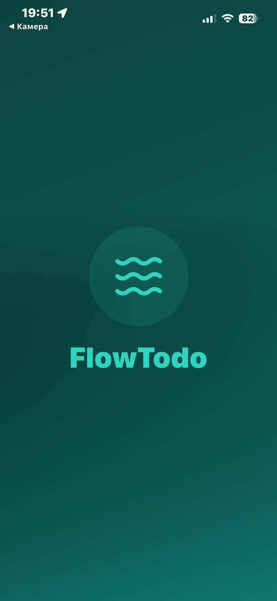
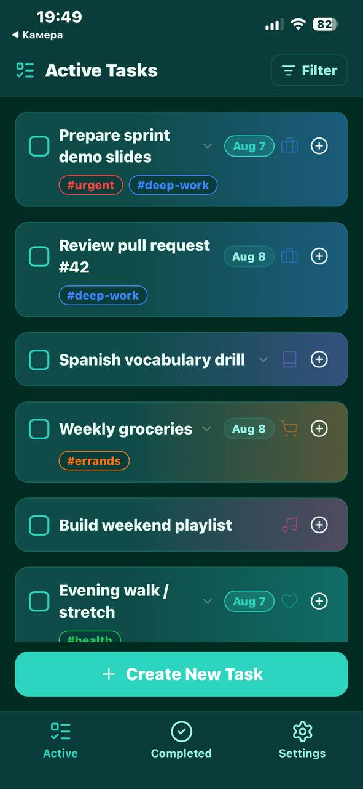
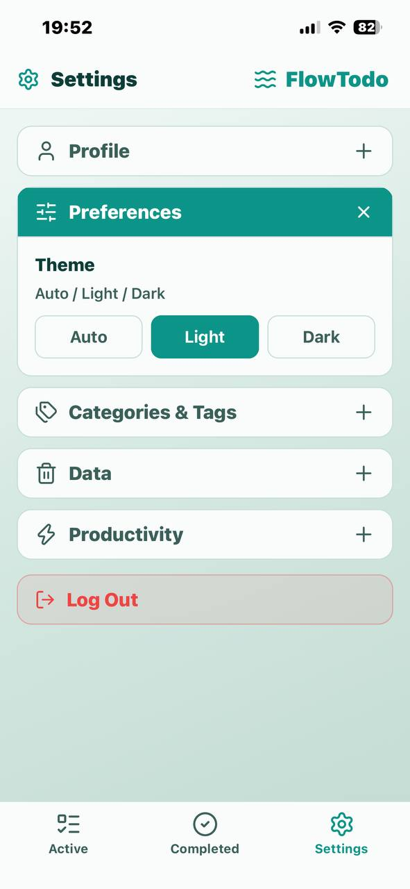
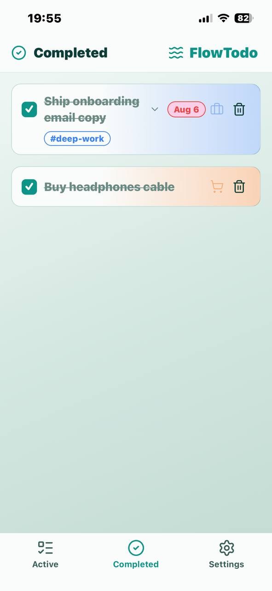

# FlowTodo

Port [NextTodo](https://github.com/matt400/NextTodo) na **Expo (React Native)** + **Supabase** — iOS, Android i web z jednej bazy kodu.

## Screenshots

| | |
|:--|:--|
|  |  |
| *Splash* | *Active tasks* |
|  |  |
| *3 · Settings* | *4 · Completed* |

## Status

| Obszar | Stan |
|--------|------|
| Auth (login / register / session) | Supabase Auth + `profiles` |
| Theme + Pomodoro duration | UI gotowe; zapis do `profiles` w osobnym PR / branchu |
| Tasks / categories / tags | Mock lokalny (UI) |
| Pomodoro timer + historia | Lokalnie (AsyncStorage / kontekst) |
| Splash screen | Brand overlay przy starcie sesji |
| Drag & drop / reorder | Później |
| Toasty | Później |

## Stack

| Warstwa | Wybór |
|---------|--------|
| Framework | Expo SDK **54** + Expo Router |
| UI | React Native + `react-native-web`, StyleSheet |
| Ikony | `lucide-react-native` |
| Auth / DB | Supabase (`supabase-js`), sesja w AsyncStorage |
| Dźwięk | `expo-av` (alarm Pomodoro) |
| Animacje | RN `Animated` / Reanimated (DnD później) |

## Run

```bash
npm install
cp .env.example .env   # uzupełnij klucze lokalnie
npm start -- -c
```

`w` = web · Expo Go = QR z terminala · SDK celowo **54** pod aktualne Expo Go.
